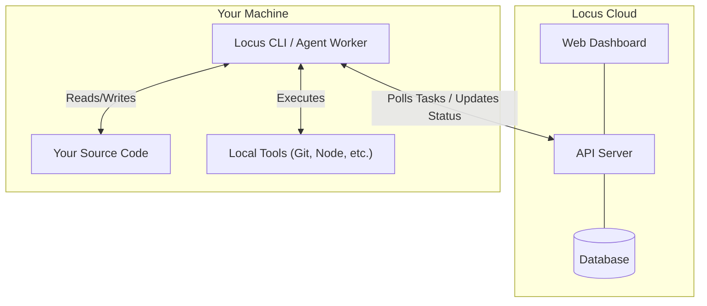

Locus employs a **Hybrid Architecture** that combines cloud-based planning with secure local execution.

## Cloud Planning, Local Execution

Locus is a SaaS platform where teams plan and coordinate work, while agents execute securely on developer machines.

### 1. Cloud Platform
The Locus Cloud (API & Dashboard) provides:
- **Sprint Planning**: Define sprints, milestones, and project timelines.
- **Task Management**: Create, prioritize, and assign tasks with detailed acceptance criteria.
- **Documentation Hub**: Write and organize project documentation designed for AI agents.
- **Team Coordination**: Visibility and collaboration across your engineering team.

### 2. Secure Local Execution
Agents run securely on your machine, providing:
- **Local File Access**: No need to sync files to a remote sandbox.
- **Local Tool Execution**: The agent can run `npm install`, `docker build`, or `cargo test` exactly as you would.
- **Privacy**: Your source code stays on your machine. Only task updates and summaries are synced to the cloud.

## Component Overview

## Workflow

1. **Task Creation**: You create a task in the Web Dashboard (or ask the agent to create one).
2. **Dispatch**: You run `locus run` on your terminal. The CLI connects to the API and asks for work.
3. **Execution**: The CLI receives the task assignment. It reads your code, plans a solution, and executes changes.
4. **Verification**: The agent runs local tests to verify the fix.
5. **Completion**: The agent commits changes, opens a PR when possible, and updates the task status to `IN_REVIEW`.
