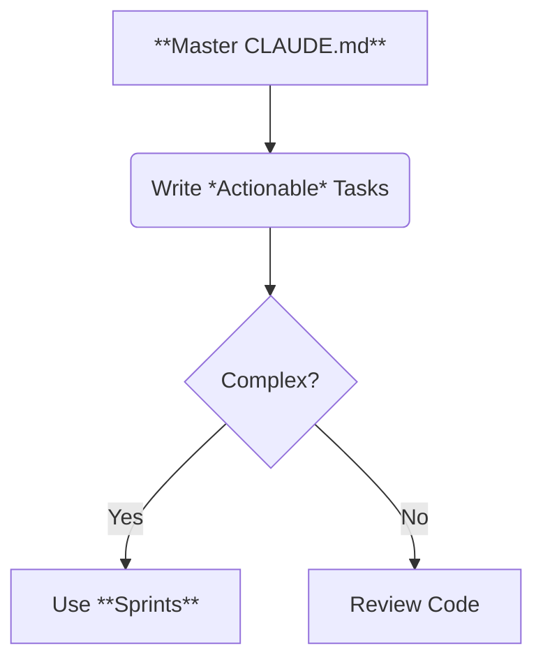

To get the most out of your AI engineering workforce, you need to communicate effectively. Here are the best practices for working with Locus agents.



## 1. Master the `CLAUDE.md`

The `CLAUDE.md` file in your project root is the single most important file for guiding agent behavior. It is injected into the context of **every** task.

**What to include:**
- **Code Style**: "Use React functional components", "Prefer types over interfaces".
- **Architecture**: "We use a Feature-First folder structure", "Business logic goes in services, not controllers".
- **Commands**: "Run tests with `bun test`", "Lint with `biome lint`".
- **Gotchas**: "Always mock the payment gateway in tests".

**Example `CLAUDE.md`:**
```markdown
# Project Context

## Tech Stack
- Typescript, Next.js 14, TailwindCSS
- State management: Zustand

## Coding Standards
- Use `const` over `let`.
- Early returns preferred.
- All exported functions must have TSDoc.

## Commands
- Build: `npm run build`
- Test: `npm run test`
```

## 2. Write Actionable Tasks

Agents thrive on specific instructions. Vague tasks lead to vague results.

| Bad Task | Good Task |
|----------|-----------|
| "Fix the login page" | "Fix the layout shift on the login page when the error message appears. Ensure the form container has a fixed height." |
| "Add dark mode" | "Implement dark mode using `next-themes`. Add a toggle in the Navbar. Use Tailwind `dark:` classes for invalidating colors." |

> [!TIP]
> Include the **Definition of Done** in your task description. For example: "The task is done when the 'Submit' button is disabled while loading."

## 3. Use Sprints for Complex Features

Don't creating one giant task like "Build the new Billing Dashboard". Break it down into a Sprint:

1. Create a Sprint: "Billing Dashboard Implementation".
2. Add Tasks:
   - "Create API endpoints for invoice history"
   - "Implement frontend API client for billing"
   - "Create InvoiceList component"
   - "Create BillingSummary component"
3. Let the agent plan! The agent will see these tasks together and generate a **Mindmap** to ensure the API and Frontend match.

## 4. Review Code Carefully

Treat agent code like junior developer code.
- **Verify**: Does it actually work? Run the app.
- **Read**: Did it introduce weird dependencies?
- **Security**: Did it hardcode any secrets? (Locus agents are trained not to, but always check).
