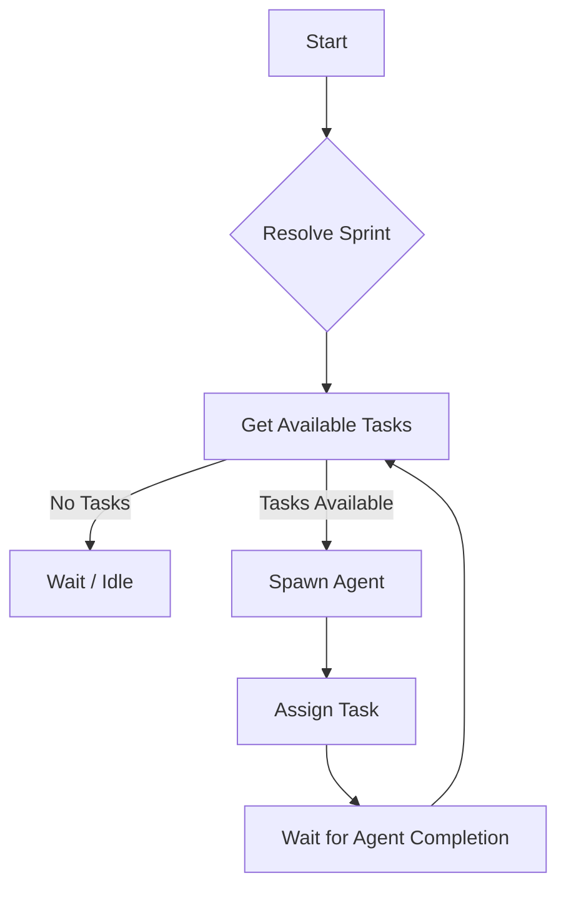

Locus workflows are driven by an **Orchestrator** and one or more **Agents**. This document explains the technical details of how these components interact to execute your tasks.

## The Orchestrator

The `AgentOrchestrator` is the central brain that manages the lifecycle of agents. It is responsible for:

1.  **Sprint Resolution**: Determining which sprint to work on. It looks for a specific `sprintId` in the config or automatically finds the currently active sprint in your workspace.
2.  **Agent Spawning**: Creating `AgentWorker` processes to execute tasks.
3.  **Task Assignment**: Fetching available tasks from the backlog and assigning them to idle agents based on priority (Critical > High > Medium > Low).
4.  **Lifecycle Management**: Monitoring agent health, reaping completed agents, and handling failures.

### The Orchestration Loop

The orchestrator runs a continuous loop:

## The Agent Worker

The `AgentWorker` is the autonomous entity that actually performs the work. Each worker is an isolated process that runs through the following cycle:

1.  **Initialization**: Sets up the `LocusClient`, AI runners (Claude/Anthropic), and necessary services (Indexer, Sprint Planner).
2.  **Planning**: If a new sprint is detected, the worker may trigger a "Sprint Planning" phase to generate a mindmap of the tasks.
3.  **Execution Loop**:
    *   **Claim Task**: Requests a task from the orchestrator/API.
    *   **Execute**: Uses the `TaskExecutor` service to analyze the codebase, plan changes, and write code.
    *   **Verify**: Runs tests or verification steps.
    *   **Sync**: Syncs artifacts (logs, plans) back to the server.
    *   **Report**: Updates the task status to `VERIFICATION` (on success) or `BACKLOG` (on failure) with a summary comment.

### Worker Capabilities

*   **Codebase Indexing**: Maintains an up-to-date index of your project files for accurate context retrieval.
*   **Artifact Syncing**: Automatically uploads implementation plans and logs to the dashboard.
*   **Smart Retry**: Capable of retrying failed steps or adapting its plan based on errors.

## Task States

Tasks move through specific states during a workflow:

*   **BACKLOG**: Waiting to be picked up.
*   **IN_PROGRESS**: Currently assigned to an agent (`WORKING` status).
*   **VERIFICATION**: Completed by the agent, awaiting user review.
*   **DONE**: approved by the user.
