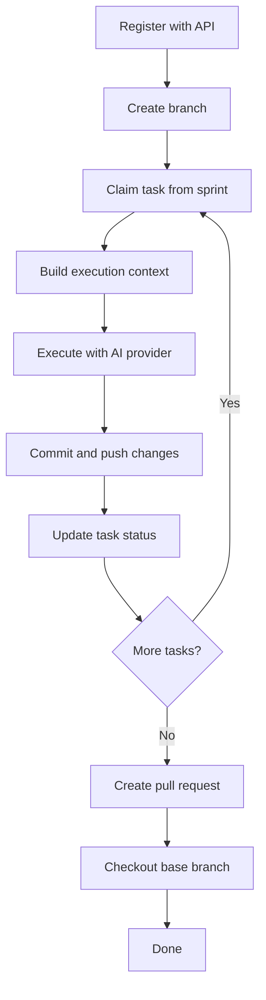

# Agents

## Overview

The agent is an AI-powered worker that executes tasks on your machine. It uses either **Claude** (Anthropic) or **Codex** (OpenAI) as its AI provider to read your codebase, make changes, and create a pull request.

---

## Agent Lifecycle



---

## AI Providers

| Provider | CLI Name | Description |
|----------|----------|-------------|
| Claude   | `claude` | Anthropic's Claude (default) |
| Codex    | `codex`  | OpenAI's Codex |

Set your provider during configuration:

```bash
locus config setup --provider claude
```

Or override per run:

```bash
locus run --provider codex
```

---

## Single-Branch Workflow

When you run `locus run`, the agent creates a **single branch** (e.g. `locus/<sprintId>`) and executes all tasks sequentially on that branch.

After each task:
* Changes are committed with a descriptive message
* The branch is pushed to remote

When all tasks are done:
* A pull request is created targeting the base branch
* The base branch is checked out

---

## Agent Context

Before executing a task, Locus builds a rich context for the agent that includes:

* **Project metadata** — from `.locus/config.json`
* **Agent instructions** — from `.locus/LOCUS.md`
* **Codebase index** — from `.locus/codebase-index.json` (if indexed)
* **Workspace documents** — from `.locus/documents/`
* **Task details** — title, description, acceptance checklist
* **Sprint context** — current sprint and related tasks
* **Project knowledge** — from `.locus/project/context.md`
* **Progress tracking** — from `.locus/project/progress.md`

---

## Health Monitoring

The active agent sends a **heartbeat** to the API every minute. This lets the dashboard and API track whether the agent is alive and working.

---

## Graceful Shutdown

Press `Ctrl+C` during `locus run` to gracefully shut down the agent. Locus will:

1. Signal the running agent to stop
2. Wait for the current operation to complete
3. Checkout the base branch
4. Update task statuses appropriately
