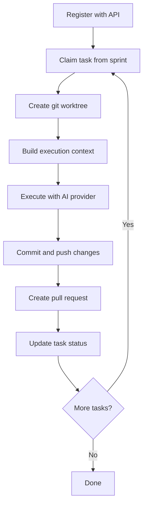

# Agents

## Overview

Agents are AI-powered workers that execute tasks on your machine. Each agent uses either **Claude** (Anthropic) or **Codex** (OpenAI) as its AI provider to read your codebase, make changes, and create pull requests.

---

## Agent Lifecycle



---

## AI Providers

| Provider | CLI Name | Description |
|----------|----------|-------------|
| Claude   | `claude` | Anthropic's Claude (default) |
| Codex    | `codex`  | OpenAI's Codex |

Set your provider during configuration:

```bash
locus config setup --provider claude
```

Or override per run:

```bash
locus run --provider codex
```

---

## Worktree Isolation

When running agents, Locus creates **git worktrees** — isolated copies of your repository where each agent works independently.

```
your-project/
└── .locus-worktrees/
    ├── agent/task-123-add-auth/       # Agent 1's workspace
    ├── agent/task-456-fix-pagination/ # Agent 2's workspace
    └── agent/task-789-update-tests/   # Agent 3's workspace
```

Each worktree:
* Has its own branch (`agent/<taskId>-<slug>`)
* Contains a full copy of the repository
* Is automatically created and cleaned up


Worktree isolation is **automatic** when running multiple agents. For single-agent runs, it's also enabled by default but can be controlled with `--worktree`.


### Managing Worktrees

```bash
# List active worktrees
locus agents list

# Clean up stale worktrees
locus agents clean

# Remove all worktrees
locus agents clean --all
```

---

## Agent Context

Before executing a task, Locus builds a rich context for the agent that includes:

* **Project metadata** — from `.locus/config.json`
* **Agent instructions** — from `.locus/LOCUS.md`
* **Codebase index** — from `.locus/codebase-index.json` (if indexed)
* **Workspace documents** — from `.locus/documents/`
* **Task details** — title, description, acceptance checklist
* **Sprint context** — current sprint and related tasks
* **Project knowledge** — from `.locus/project/context.md`
* **Progress tracking** — from `.locus/project/progress.md`

---

## Health Monitoring

Active agents send a **heartbeat** to the API every 10 minutes. This lets the dashboard and API track which agents are alive and working.

---

## Graceful Shutdown

Press `Ctrl+C` during `locus run` to gracefully shut down all agents. Locus will:

1. Signal all running agents to stop
2. Wait for current operations to complete
3. Update task statuses appropriately
4. Clean up resources
