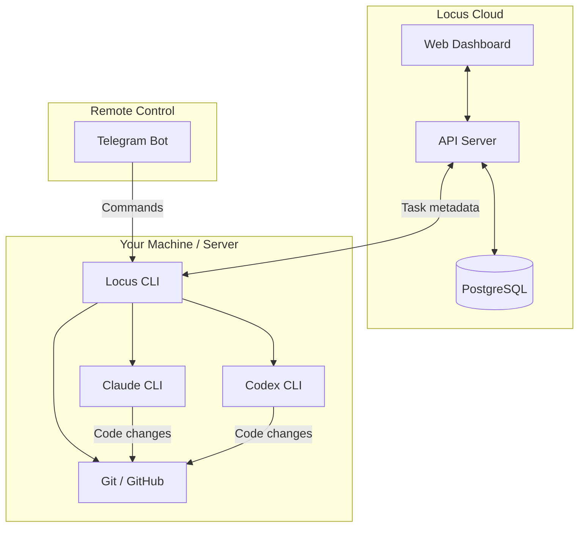
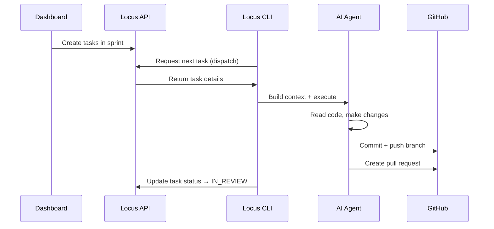
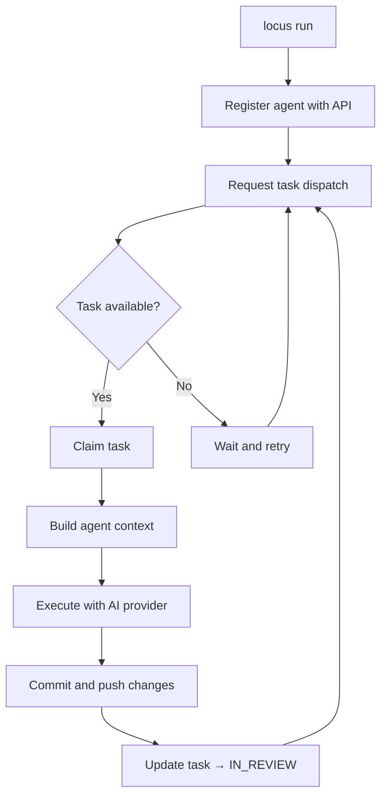
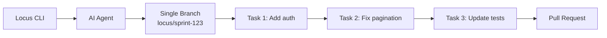

# Architecture

## Design Principle

Locus follows a **split architecture** — planning happens in the cloud, execution happens on your machine. Your source code never leaves your infrastructure.

---

## What Runs Where

| Component | Location | Purpose |
|-----------|----------|---------|
| Dashboard | Cloud (`app.locusai.dev`) | Create tasks, manage sprints, view progress |
| API Server | Cloud (`api.locusai.dev`) | Task dispatch, workspace management, auth |
| Locus CLI | Your machine | Orchestrate agents, run tasks, manage config |
| AI Agents | Your machine | Execute tasks using Claude or Codex |
| Telegram Bot | Your machine | Remote command interface |
| Git Operations | Your machine | Branch creation, commits, PR creation |


The cloud API only handles **task metadata** — titles, descriptions, statuses, priorities, and acceptance criteria. No source code is ever transmitted.


---

## Data Flow

---

## Task Execution Flow

When you run `locus run`, the following happens:

When all tasks are completed, the agent creates a single pull request and checks out the base branch.

---

## Sequential Execution

The agent executes tasks one at a time on a **single branch**:

1. Creates a branch (e.g. `locus/<sprintId>`) at the start
2. Claims tasks one by one via server-side dispatch
3. Commits and pushes after each completed task
4. Creates a **single PR** when all tasks are done
5. Checks out the base branch


All tasks are committed to the same branch sequentially. This keeps the workflow simple and avoids merge conflicts.

