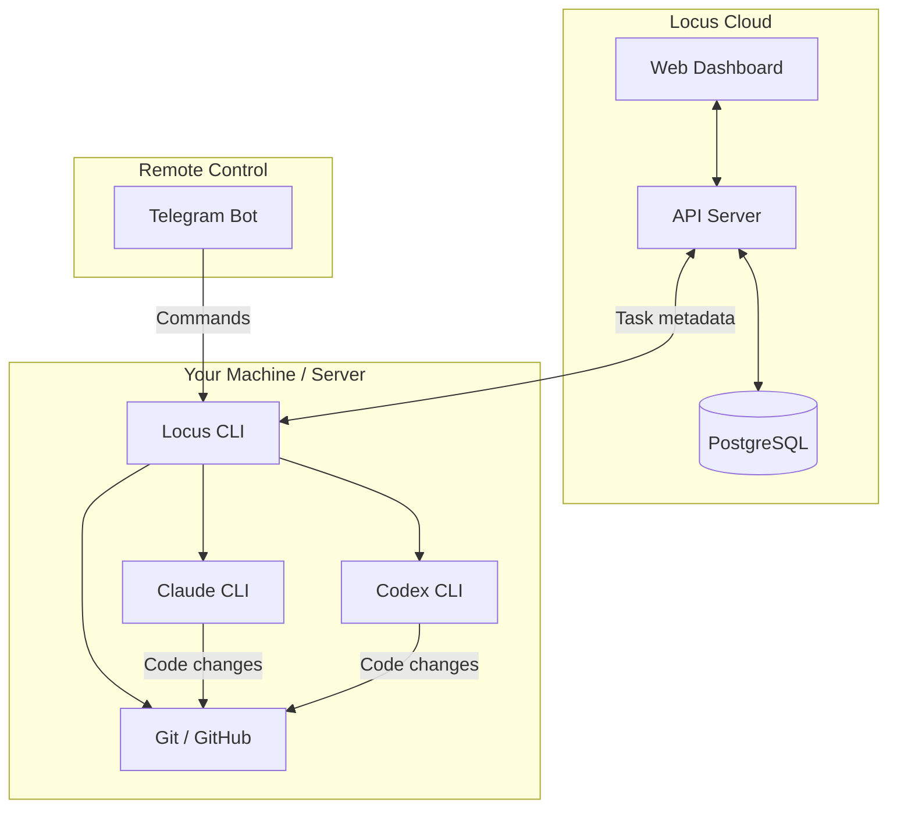
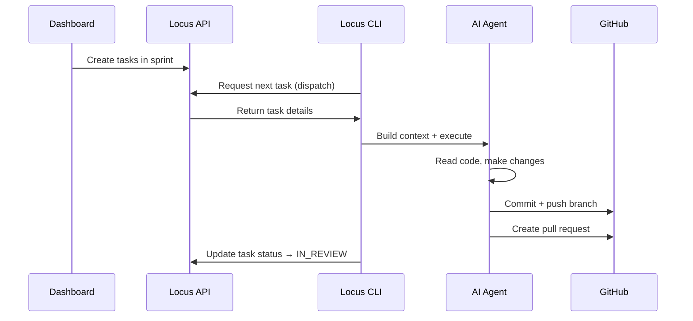
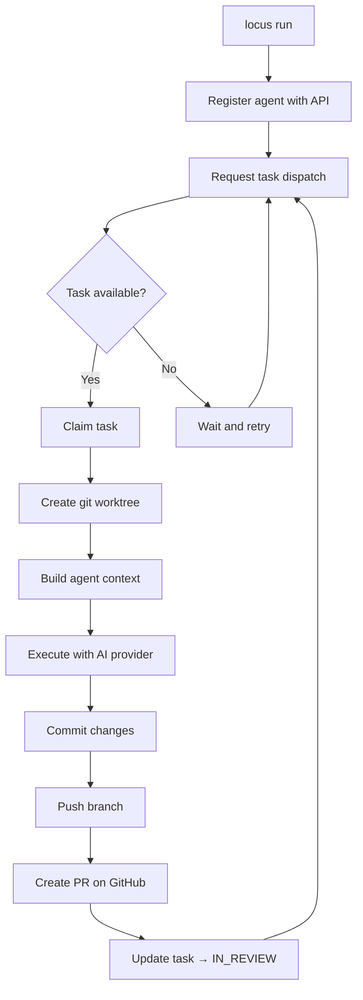
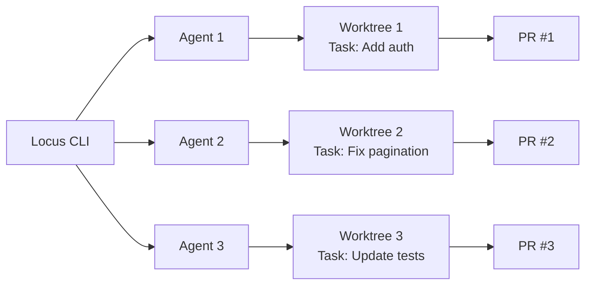

# Architecture

## Design Principle

Locus follows a **split architecture** — planning happens in the cloud, execution happens on your machine. Your source code never leaves your infrastructure.

---

## What Runs Where

| Component | Location | Purpose |
|-----------|----------|---------|
| Dashboard | Cloud (`app.locusai.dev`) | Create tasks, manage sprints, view progress |
| API Server | Cloud (`api.locusai.dev`) | Task dispatch, workspace management, auth |
| Locus CLI | Your machine | Orchestrate agents, run tasks, manage config |
| AI Agents | Your machine | Execute tasks using Claude or Codex |
| Telegram Bot | Your machine | Remote command interface |
| Git Operations | Your machine | Branch creation, commits, PR creation |


The cloud API only handles **task metadata** — titles, descriptions, statuses, priorities, and acceptance criteria. No source code is ever transmitted.


---

## Data Flow

---

## Task Execution Flow

When you run `locus run`, the following happens:

---

## Multi-Agent Execution

When running multiple agents (`locus run --agents 3`), each agent:

1. Gets its own **git worktree** — an isolated copy of the repository
2. Claims a **separate task** — server-side locking prevents conflicts
3. Works **independently** — no shared state between agents
4. Creates its own **branch and PR** — named `agent/<taskId>-<slug>`


Maximum of **5 parallel agents** per CLI instance. Each agent requires its own worktree, so ensure you have sufficient disk space.

