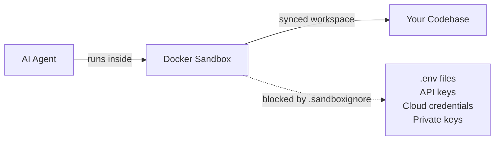

# Auto-Approval Mode

Auto-approval mode is the high-automation operating style in Locus:

- Provider execution runs in full-auto mode (`claude --dangerously-skip-permissions` or `codex exec --full-auto`)
- Issue lifecycle labels are auto-managed (`agent.autoLabel`)
- PRs are auto-created after successful execution (`agent.autoPR`)
- Interrupted runs resume from saved state (`locus run --resume`)

---

## Sandboxing: Safe Full-Auto Execution

Full-auto mode gives AI agents unrestricted access to your codebase. **Docker sandbox isolation** is the key safety mechanism that makes this safe for teams.

### What Sandboxing Protects



When sandboxed:
- AI agents execute inside an isolated Docker container
- Only files allowed by `.sandboxignore` rules are visible to the agent
- `.env`, `*.pem`, `*.key`, cloud credential directories are excluded by default
- Agents cannot access host-level paths, credentials, or system resources

### Running with Required Sandbox

For maximum safety, require sandboxing so execution fails if Docker is unavailable:

```bash
locus run --sandbox=require
```

This is recommended for CI environments and team workflows where accidental unsandboxed execution should be prevented.

### Sandbox Modes

| Mode | Flag | Behavior |
|------|------|----------|
| Auto (default) | *(no flag)* | Use sandbox if available, warn and fall back if not |
| Required | `--sandbox=require` | Fail if sandbox is unavailable |
| Disabled | `--no-sandbox` | Run unsandboxed (shows safety warning) |

Full setup guide: [Sandboxing Setup](../getting-started/sandboxing-setup.md)

---

## Safety Controls

| Control | Default | Purpose |
|---|---|---|
| `agent.autoLabel` | `true` | Keep GitHub status labels in sync during execution |
| `agent.autoPR` | `true` | Automatically create PRs for successful tasks |
| `sprint.stopOnFailure` | `true` | Stop sprint on first failure instead of cascading |
| `agent.rebaseBeforeTask` | `true` | Detect base-branch drift/conflicts between tasks |
| `agent.maxParallel` | `3` | Bound concurrent standalone issue execution |
| `--dry-run` | off | Preview execution without writes |
| `--resume` | off | Continue from failed/interrupted checkpoint |

---

## When to Use Auto-Approval

**Use auto-approval when:**

- Tasks are well-scoped with explicit acceptance criteria
- Strong CI and branch protections are enforced
- Docker sandboxing is enabled
- The team is comfortable with AI-generated PRs

**Prefer manual approval when:**

- Changes touch auth, payments, migrations, or production-critical paths
- Requirements are ambiguous or expected to change during execution
- A one-off issue needs human checkpoints before any PR is opened

---

## Scenario 1: Sprint Autopilot with Resume

```bash
# Setup
locus sprint active "Sprint 8"
locus config set agent.autoLabel true
locus config set agent.autoPR true

# Run with sandbox enforcement
locus run --sandbox=require

# If interrupted or failed
locus logs --level error --lines 200
locus run --resume
```

**What happens:**
- Task labels update automatically (`queued → in-progress → done/failed`)
- Sprint halts on failure (by default), then resumes from checkpoint
- PRs are created automatically for successful tasks
- All execution is sandboxed

---

## Scenario 2: Parallel Backlog Sweep

```bash
# Setup
locus config set agent.maxParallel 2

# Run independent issues in parallel
locus run 141 142 143 144
locus status

# Re-run only failed issues
locus run 142 144
```

**What happens:**
- Independent issues execute in bounded parallel batches
- Each issue gets its own git worktree and branch
- Successful tasks open PRs automatically
- Failed tasks remain visible via `locus:failed` labels

---

## Manual-Approval Profile

If you need tighter control, disable PR automation:

```bash
locus config set agent.autoPR false
locus run --dry-run     # Preview first
locus run               # Execute
# Review changes manually, open PRs yourself
```

---

## Safety Checklist

Before any auto-approval run:

- [ ] Docker sandboxing is set up (`locus sandbox status`)
- [ ] Active sprint or issue list is correct
- [ ] Branch protections and required CI checks are enabled
- [ ] `agent.maxParallel` matches repo/CI capacity
- [ ] `sprint.stopOnFailure` is enabled for sprint runs
- [ ] `.sandboxignore` includes `.env`, credential files, and cloud config directories

---

## Rollback

If auto-approval is too risky for the current work:

1. Stop execution (`Ctrl+C`)
2. Disable auto PR: `locus config set agent.autoPR false`
3. Check status: `locus status` and `locus logs --level error --lines 200`
4. Close automation PRs if needed:

```bash
gh pr list --label agent:managed --state open
gh pr close <pr-number> --comment "Rolling back to manual mode"
```

5. Continue with manual gating (`locus run --dry-run`, targeted `locus run <issue>`)

## Related Docs

- [Sandboxing Setup](../getting-started/sandboxing-setup.md)
- [Security & Sandboxing](security-sandboxing.md)
- [Built-In Tools](../cli/overview.md)
- [Execution Model](execution-model.md)
