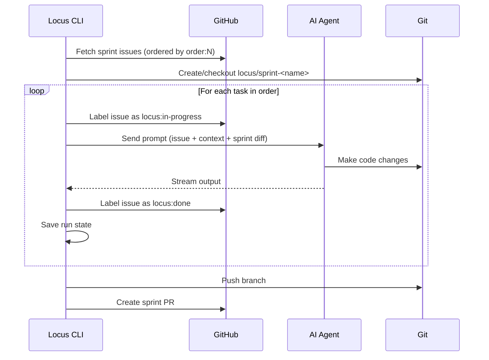
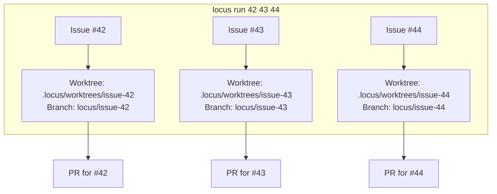
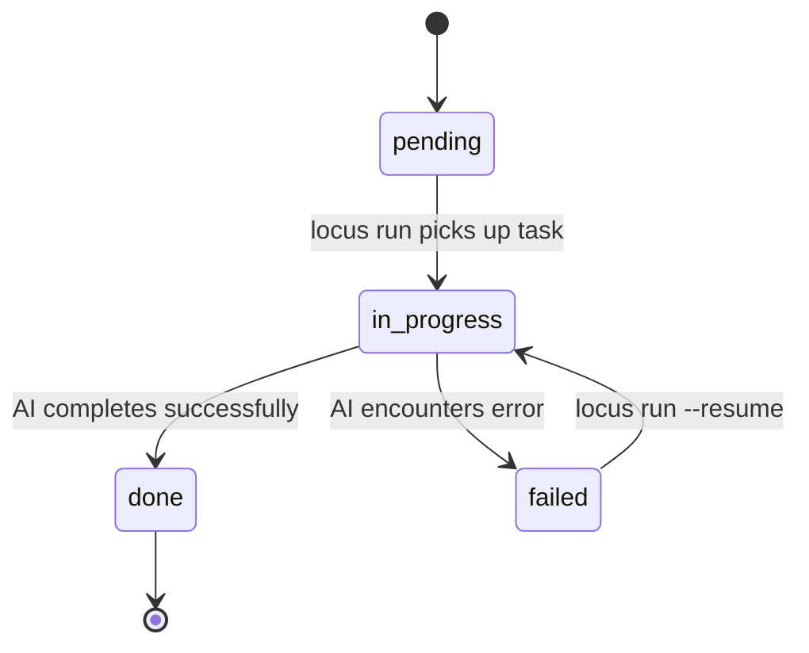
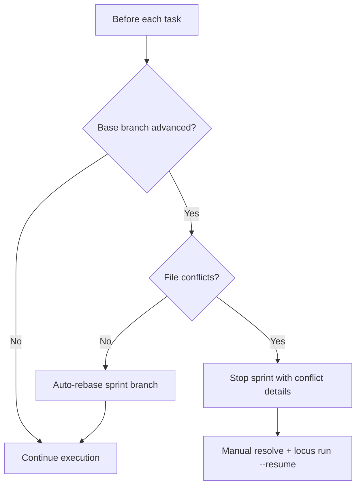

# Execution Model

## Overview

Locus supports two execution modes:

- **Sprint mode** -- Tasks run sequentially on a single branch
- **Standalone mode** -- Tasks run in parallel using git worktrees

The mode is determined automatically based on how you invoke `locus run`.

---

## Sprint Mode (Sequential)

Sprint mode activates when you run `locus run` with an active sprint and no issue numbers.

```bash
locus sprint active "Sprint 1"
locus run
```

### How It Works



1. Locus creates (or checks out) a branch named `locus/sprint-<name>`.
2. Issues are fetched from the milestone and sorted by `order:N` labels.
3. Each task executes sequentially on this single branch. After task N completes, task N+1 begins with all of task N's changes already present.
4. Before each task (except the first), Locus provides **sprint context** -- the cumulative diff from the base branch -- so the AI agent knows what previous tasks changed.
5. Run state is persisted continuously for resume support.

### Why Sequential

Sprint tasks build on each other. Task 2 may depend on files created by task 1. Running them on a single branch in order ensures each task sees the full state of all previous work.

### Sprint Branch Naming

```
locus/sprint-<normalized-sprint-name>
```

| Sprint Name | Branch |
|---|---|
| Sprint 1 | `locus/sprint-sprint-1` |
| Auth Feature | `locus/sprint-auth-feature` |
| v2.0 Migration | `locus/sprint-v2.0-migration` |

---

## Standalone Mode (Parallel)

Standalone mode activates when you pass one or more issue numbers to `locus run`.

### How It Works



```bash
# Single issue -- isolated worktree
locus run 42

# Multiple issues -- parallel worktrees
locus run 42 43 44
```

- Each issue runs in its own git worktree at `.locus/worktrees/issue-<N>`
- Each worktree gets its own branch: `locus/issue-<N>`
- Concurrency is controlled by `agent.maxParallel` (default: 3)
- On success, worktrees are cleaned up automatically
- On failure, worktrees are preserved for debugging

### Restrictions

Sprint issues (those assigned to a milestone) cannot be run in parallel. Use sprint mode instead.

---

## Task Lifecycle



| Status | GitHub Label | What Happens |
|---|---|---|
| Pending | `locus:queued` | Task is waiting for execution |
| In Progress | `locus:in-progress` | AI agent is currently working |
| Done | `locus:done` | PR created, summary comment posted on issue |
| Failed | `locus:failed` | Error comment posted, sprint stops (if `stopOnFailure`) |

---

## Run State & Resume

Locus tracks execution progress in `.locus/run-state.json`:

```json
{
  "runId": "run-2026-02-24T10-30-00",
  "type": "sprint",
  "sprint": "Sprint 1",
  "branch": "locus/sprint-sprint-1",
  "tasks": [
    { "issue": 15, "order": 1, "status": "done", "pr": 20 },
    { "issue": 16, "order": 2, "status": "failed", "error": "..." },
    { "issue": 17, "order": 3, "status": "pending" }
  ]
}
```

Resume from failures:

```bash
locus run --resume
```

1. Loads existing run state
2. For sprint runs, checks out the sprint branch
3. Finds the first failed task (for retry) or next pending task
4. Resets failed tasks to pending and re-executes
5. Continues through remaining pending tasks

The run state is automatically deleted when all tasks complete successfully.

---

## Conflict Handling

During sprint execution, the base branch may advance. Locus detects this and handles it automatically.



If `agent.rebaseBeforeTask` is enabled (default):
- **No conflicts:** Locus auto-rebases the sprint branch onto the latest base
- **Conflicts detected:** Sprint stops with a list of conflicting files and instructions to resolve manually

---

## PR Creation

When `agent.autoPR` is enabled (default), Locus creates PRs automatically:

- **Sprint runs:** Single sprint-level PR referencing all completed issues (`Closes #N`)
- **Standalone runs:** One PR per issue

The `Closes #N` syntax ensures GitHub automatically closes the issue when the PR is merged.

---

## Dry Run

Preview execution without making changes:

```bash
locus run --dry-run
```

Fetches issues, displays the execution plan (provider, model, prompt length), but does not create branches, run agents, update labels, or create PRs.

---

## Interruption

Pressing **ESC** or **Ctrl+C** during execution triggers graceful interruption:

- First press: sends SIGTERM, preserves partial output, saves run state
- Second press within 2 seconds: force-exits

Run state is saved so `locus run --resume` can pick up where interruption occurred.

---

## Configuration Reference

| Config Path | Default | Description |
|---|---|---|
| `agent.maxParallel` | `3` | Max concurrent tasks in parallel mode |
| `agent.autoLabel` | `true` | Auto-update issue labels during execution |
| `agent.autoPR` | `true` | Auto-create PRs for completed tasks |
| `agent.baseBranch` | `main` | Base branch for PRs and worktree creation |
| `agent.rebaseBeforeTask` | `true` | Check for base branch drift between tasks |
| `sprint.stopOnFailure` | `true` | Stop sprint execution when a task fails |
| `sprint.active` | `null` | Name of the currently active sprint |

## Related Docs

- [How Locus Works](how-it-works.md)
- [Auto-Approval Mode](auto-approval-mode.md)
- [locus run](../cli/run.md)
