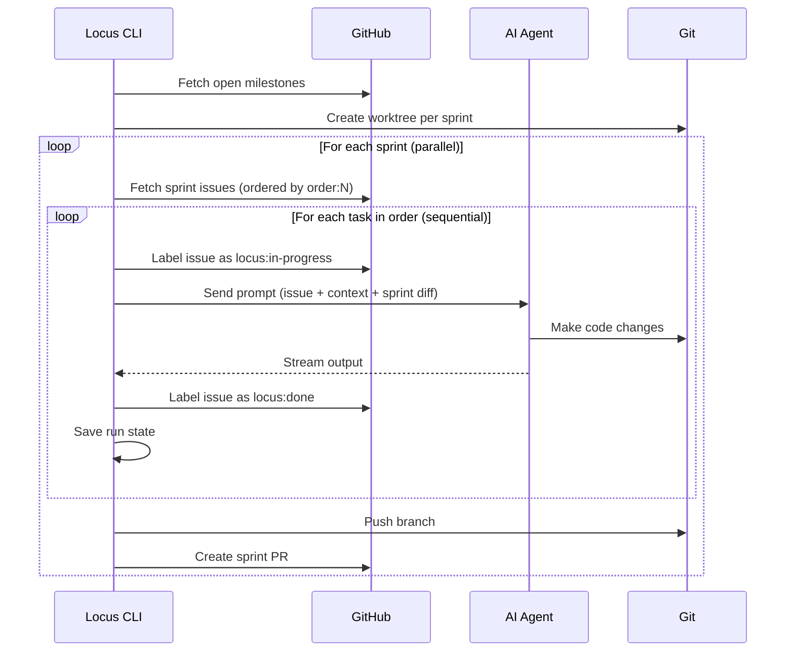
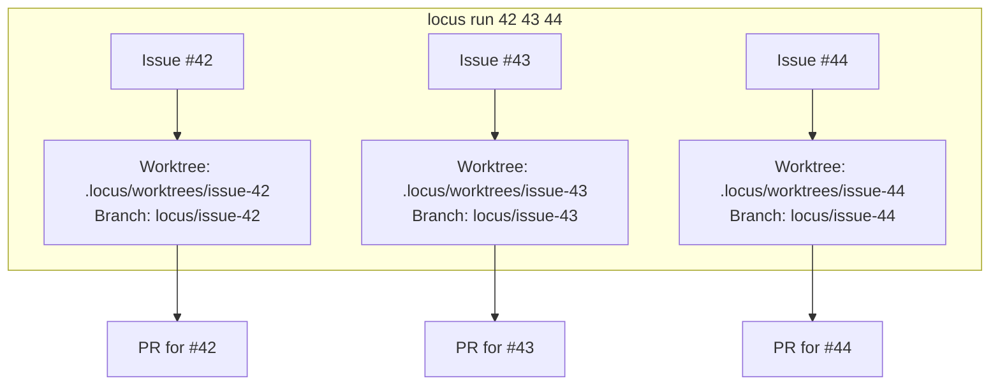
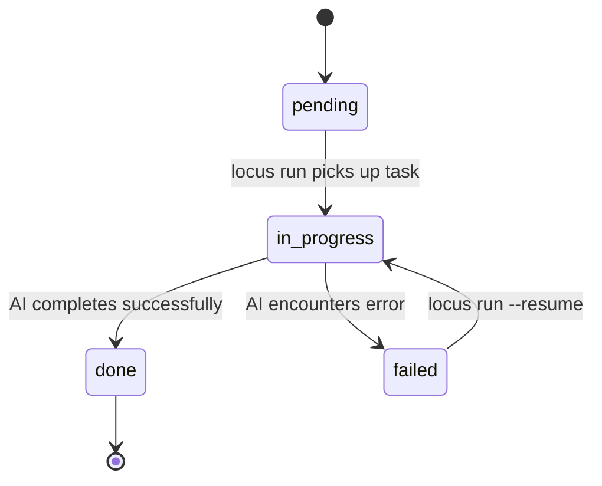
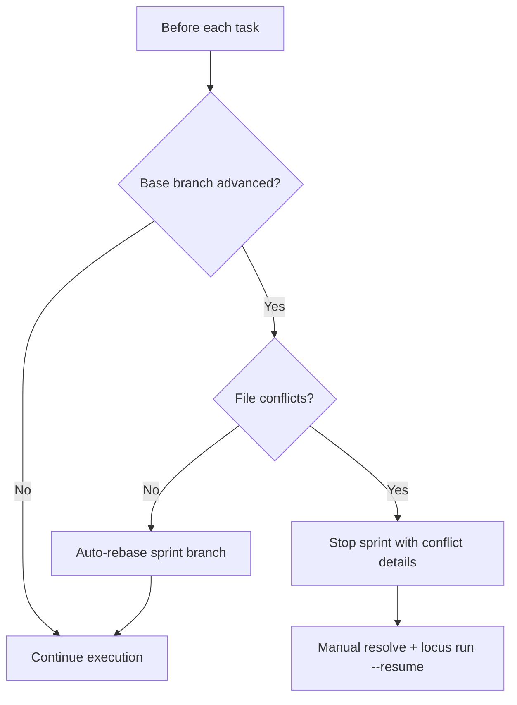

# Execution Model

## Overview

Locus supports two execution modes:

- **Sprint mode** -- Each sprint runs in its own worktree; tasks within a sprint run sequentially. Multiple sprints execute in parallel.
- **Standalone mode** -- Individual issues run in parallel using git worktrees.

The mode is determined automatically based on how you invoke `locus run`.

---

## Sprint Mode

Sprint mode activates when you run `locus run` without issue numbers. Locus auto-detects all open sprints (GitHub Milestones) and runs them.

```bash
# Run all open sprints in parallel
locus run

# Run a specific sprint
locus run --sprint "Sprint 1"
```

### How It Works


```mermaid
sequenceDiagram
    participant L as Locus CLI
    participant GH as GitHub
    participant AI as AI Agent
    participant Git as Git

    L->>GH: Fetch open milestones
    L->>Git: Create worktree per sprint

    loop For each sprint (parallel)
        L->>GH: Fetch sprint issues (ordered by order:N)
        loop For each task in order (sequential)
            L->>GH: Label issue as locus:in-progress
            L->>AI: Send prompt (issue + context + sprint diff)
            AI->>Git: Make code changes
            AI-->>L: Stream output
            L->>GH: Label issue as locus:done
            L->>L: Save run state
        end
        L->>Git: Push branch
        L->>GH: Create sprint PR
    end
```

1. Locus fetches all open milestones via the GitHub API (or targets one with `--sprint`).
2. For each sprint, a worktree is created at `.locus/worktrees/sprint-<slug>/` with a unique branch.
3. Issues are fetched from the milestone and sorted by `order:N` labels.
4. Each task executes sequentially within the worktree. After task N completes, task N+1 begins with all of task N's changes already present.
5. Before each task (except the first), Locus provides **sprint context** -- the cumulative diff from the base branch -- so the AI agent knows what previous tasks changed.
6. Run state is persisted per-sprint in `.locus/run-state/<sprint-slug>.json` for resume support.

### Why Sequential Within a Sprint

Sprint tasks build on each other. Task 2 may depend on files created by task 1. Running them in order within the same worktree ensures each task sees the full state of all previous work.

### Why Parallel Across Sprints

Different sprints are independent work streams. Each sprint gets its own worktree and branch, so they never interfere with each other.

### Sprint Worktree Layout

```
.locus/worktrees/
  sprint-sprint-1/       # Worktree for "Sprint 1"
  sprint-auth-feature/   # Worktree for "Auth Feature"
```

Each worktree gets a branch like `locus/sprint-<slug>-<random>` (e.g., `locus/sprint-sprint-1-a3b2c1`).

---

## Standalone Mode (Parallel)

Standalone mode activates when you pass one or more issue numbers to `locus run`.

### How It Works


```mermaid
graph TB
    subgraph "locus run 42 43 44"
        A[Issue #42] --> W1[Worktree: .locus/worktrees/issue-42<br>Branch: locus/issue-42]
        B[Issue #43] --> W2[Worktree: .locus/worktrees/issue-43<br>Branch: locus/issue-43]
        C[Issue #44] --> W3[Worktree: .locus/worktrees/issue-44<br>Branch: locus/issue-44]
    end

    W1 --> PR1[PR for #42]
    W2 --> PR2[PR for #43]
    W3 --> PR3[PR for #44]
```

```bash
# Single issue -- isolated worktree
locus run 42

# Multiple issues -- parallel worktrees
locus run 42 43 44
```

- Each issue runs in its own git worktree at `.locus/worktrees/issue-<N>`
- Each worktree gets its own branch: `locus/issue-<N>`
- Concurrency is controlled by `agent.maxParallel` (default: 3)
- On success, worktrees are cleaned up automatically
- On failure, worktrees are preserved for debugging

### Restrictions

Sprint issues (those assigned to a milestone) cannot be run in parallel. Use sprint mode instead.

---

## Task Lifecycle


```mermaid
stateDiagram-v2
    [*] --> pending
    pending --> in_progress: locus run picks up task
    in_progress --> done: AI completes successfully
    in_progress --> failed: AI encounters error
    failed --> in_progress: locus run --resume
    done --> [*]
```

| Status | GitHub Label | What Happens |
|---|---|---|
| Pending | `locus:queued` | Task is waiting for execution |
| In Progress | `locus:in-progress` | AI agent is currently working |
| Done | `locus:done` | PR created, summary comment posted on issue |
| Failed | `locus:failed` | Error comment posted; sprint continues to next task (default) or stops (if `stopOnFailure: true`) |

---

## Run State & Resume

Locus tracks execution progress per-sprint in `.locus/run-state/<sprint-slug>.json` (parallel runs use `_parallel.json`):

```json
{
  "runId": "run-2026-02-24T10-30-00",
  "type": "sprint",
  "sprint": "Sprint 1",
  "branch": "locus/sprint-sprint-1-a3b2c1",
  "tasks": [
    { "issue": 15, "order": 1, "status": "done", "pr": 20 },
    { "issue": 16, "order": 2, "status": "failed", "error": "..." },
    { "issue": 17, "order": 3, "status": "pending" }
  ]
}
```

Resume from failures:

```bash
# Resume all interrupted runs
locus run --resume

# Resume a specific sprint
locus run --resume --sprint "Sprint 1"
```

1. Scans `.locus/run-state/` directory for resumable runs
2. For sprint runs, reuses the existing worktree
3. Finds the first failed task (for retry) or next pending task
4. Resets failed tasks to pending and re-executes
5. Continues through remaining pending tasks

Each sprint has independent state, so multiple sprints can be resumed in parallel. The run state file is automatically deleted when all tasks complete successfully.

---

## Conflict Handling

During sprint execution, the base branch may advance. Locus detects this and handles it automatically.


```mermaid
flowchart TD
    A[Before each task] --> B{Base branch advanced?}
    B -->|No| C[Continue execution]
    B -->|Yes| D{File conflicts?}
    D -->|No| E[Auto-rebase sprint branch]
    E --> C
    D -->|Yes| F[Stop sprint with conflict details]
    F --> G["Manual resolve + locus run --resume"]
```

If `agent.rebaseBeforeTask` is enabled (default):
- **No conflicts:** Locus auto-rebases the sprint branch onto the latest base
- **Conflicts detected:** Sprint stops with a list of conflicting files and instructions to resolve manually

---

## PR Creation

When `agent.autoPR` is enabled (default), Locus creates PRs automatically:

- **Sprint runs:** Single sprint-level PR referencing all completed issues (`Closes #N`)
- **Standalone runs:** One PR per issue

The `Closes #N` syntax ensures GitHub automatically closes the issue when the PR is merged.

---

## Dry Run

Preview execution without making changes:

```bash
locus run --dry-run
```

Fetches issues, displays the execution plan (provider, model, prompt length), but does not create branches, run agents, update labels, or create PRs.

---

## Interruption

Pressing **ESC** or **Ctrl+C** during execution triggers graceful interruption:

- First press: sends SIGTERM, preserves partial output, saves run state
- Second press within 2 seconds: force-exits

Run state is saved so `locus run --resume` can pick up where interruption occurred.

---

## Configuration Reference

| Config Path | Default | Description |
|---|---|---|
| `agent.maxParallel` | `3` | Max concurrent tasks in parallel mode |
| `agent.autoLabel` | `true` | Auto-update issue labels during execution |
| `agent.autoPR` | `true` | Auto-create PRs for completed tasks |
| `agent.baseBranch` | `main` | Base branch for PRs and worktree creation |
| `agent.rebaseBeforeTask` | `true` | Check for base branch drift between tasks |
| `sprint.stopOnFailure` | `false` | Stop sprint execution when a task fails (default: continue to next task) |

## Related Docs

- [How Locus Works](how-it-works.md)
- [Auto-Approval Mode](auto-approval-mode.md)
- [locus run](../cli/run.md)
