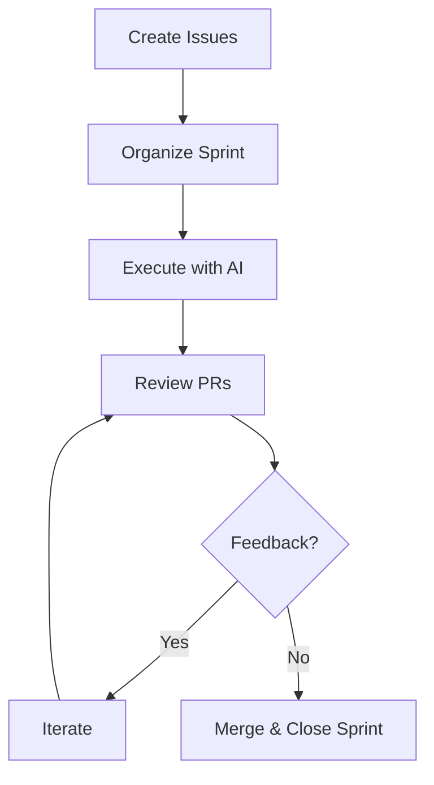
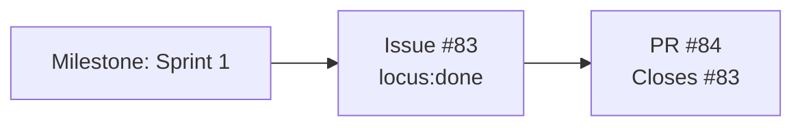
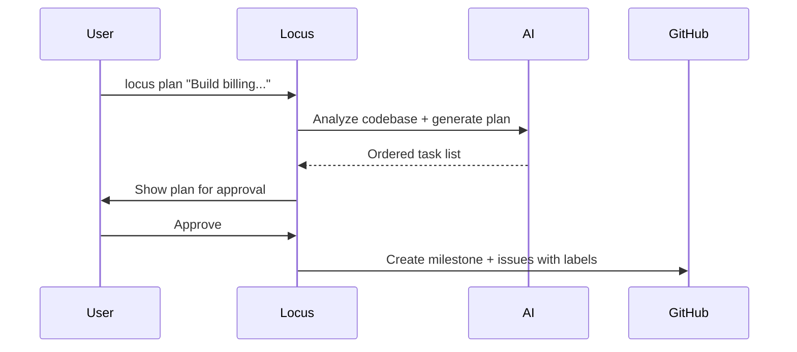
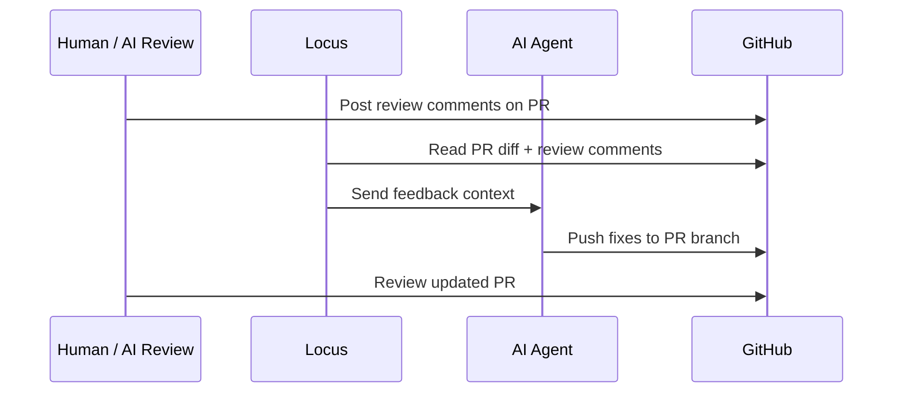

# GitHub-Native Workflows

Locus uses GitHub as an operational layer, not just a code host. Issues, Milestones, Labels, and Pull Requests carry planning and execution state that your whole team can inspect.

---

## Workflow Overview



---

## Scenario 1: Issue-Driven Delivery

The core delivery loop when you already know the task.

```bash
# Create sprint and issue
locus sprint create "Sprint 1"
locus sprint active "Sprint 1"
locus issue create "Add /health endpoint with tests" --sprint "Sprint 1"

# Execute
locus run

# Review and iterate
locus review
locus iterate --sprint

# Check progress
locus status
```

**GitHub state after execution:**



- Milestone `Sprint 1` tracks completion percentage
- Issue labels update: `locus:queued` → `locus:in-progress` → `locus:done`
- PR created with `Closes #83` so merging auto-closes the issue

---

## Scenario 2: AI-Powered Planning

Let AI break down a high-level goal before execution.

```bash
# Generate plan
locus plan "Build billing webhook ingestion with retries" --sprint "Sprint 2"

# Review what was created
locus sprint show "Sprint 2"

# Execute when ready
locus sprint active "Sprint 2"
locus run
```

**What happens:**



- AI reads `LOCUS.md`, file tree, and recent git history
- Generates ordered issues with priority, type, and execution sequence
- Issues are created on GitHub with labels: `p:*`, `type:*`, `locus:queued`, `agent:managed`, `order:N`

---

## Scenario 3: Review and Iteration Loop

When PR feedback needs to be addressed by AI.

```bash
# List open agent PRs
gh pr list --label agent:managed --state open

# Post review feedback (or let AI review)
locus review 15

# Iterate on the feedback
locus iterate --pr 15

# Review again until satisfied
locus review 15
```

**What happens:**



- Review feedback is persisted as GitHub PR comments
- Iteration updates PR branches with targeted fixes
- Label/status lifecycle stays visible for async team coordination

---

## Troubleshooting

### `gh` is not installed or not authenticated

```bash
gh --version
gh auth status || gh auth login
locus init
```

### Not in a git repository (or missing GitHub remote)

```bash
git status
git remote -v
# Add/fix origin, then re-run init
locus init
```

### `locus run` says no active sprint

```bash
locus sprint list
locus sprint active "Sprint 1"
locus run
```

### Rate limit or transient API failures

Wait for GitHub rate limit reset window, then rerun. For interrupted sprints:

```bash
locus run --resume
```

## Related Docs

- [GitHub as Backend](github-backend.md)
- [How Locus Works](how-it-works.md)
- [Sprints and Issues](sprints-and-issues.md)
- [Built-In Tools](../cli/overview.md)
