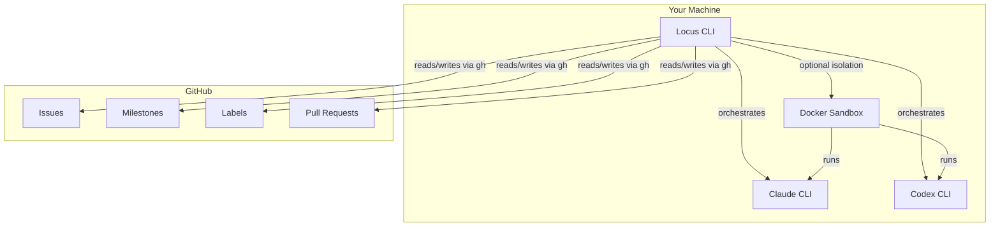
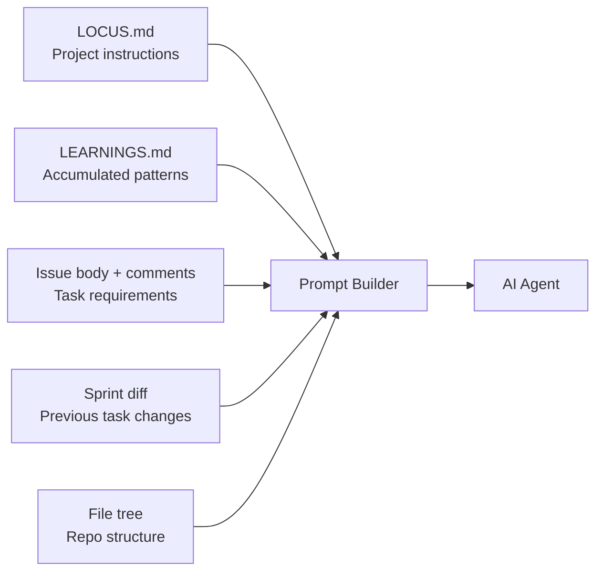
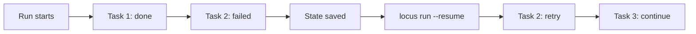

# How Locus Works

Locus is a GitHub-native AI engineering CLI. It turns GitHub Issues into code changes by orchestrating AI agents that read your codebase, implement tasks, and open pull requests -- all through the tools you already use.

There is no custom backend, no dashboard, and no separate account. GitHub **is** the backend. Authentication is handled entirely by the GitHub CLI (`gh auth login`).

---

## The Pipeline

Every Locus workflow follows a four-stage pipeline:


### 1. Plan

Define what needs to be done. You can create issues manually or let AI generate a structured sprint plan from a high-level directive.

```bash
# AI-generated sprint plan
locus plan "Add user authentication with OAuth"

# Or create issues directly
locus issue create "Add login page" --type feature --priority high
```

Planning produces GitHub Issues with labels for priority, type, and execution order, grouped under a GitHub Milestone (the sprint).

### 2. Execute

AI agents pick up issues and implement them. In sprint mode, tasks run sequentially on a single branch. For standalone issues, tasks run in parallel using git worktrees.

```bash
# Run the active sprint
locus run

# Run a single issue
locus run 42

# Run multiple issues in parallel
locus run 42 43 44
```

The agent reads the issue description, your project instructions (`LOCUS.md`), accumulated learnings (`LEARNINGS.md`), and repository context to build a rich prompt. It then delegates to an AI provider (Claude or Codex) that makes the actual code changes.

### 3. Review

Each completed task produces a pull request on GitHub. AI reviews the PR and posts inline feedback.

```bash
locus review
```

### 4. Iterate

If a PR needs changes, Locus reads the review comments and sends them back to the AI agent for a targeted follow-up pass.

```bash
locus iterate 15
```

The agent receives the PR diff and all review comments, then makes focused changes without rewriting code from scratch.

---

## Architecture



**Key points:**
- Locus does not contain an AI model. It orchestrates external AI CLIs (Claude or Codex).
- All state lives in GitHub -- issues, milestones, labels, and PRs.
- Docker sandboxes provide optional isolation for safe execution.
- The `gh` CLI handles all GitHub API communication.

---

## GitHub-Native Data Model

| Locus Concept | GitHub Primitive |
|---------------|------------------|
| Tasks | Issues |
| Sprints | Milestones |
| Metadata | Labels |
| Deliverables | Pull Requests |
| Auth | `gh auth login` |

There is no database, no API server, and no cloud service. Every operation is a `gh` CLI call.

---

## Context Injection

Before every task, Locus assembles a prompt from multiple sources:



| Source | Purpose |
|--------|---------|
| `LOCUS.md` | Project instructions, conventions, architecture |
| `.locus/LEARNINGS.md` | Accumulated corrections and patterns |
| Issue body + comments | Task requirements and discussion |
| Sprint diff | Changes from previous tasks (sprint mode only) |
| Repository file tree | Structural awareness |

**LOCUS.md** is the primary file you edit to teach the AI about your project. It lives at the repository root and is read before every execution.

**LEARNINGS.md** captures lessons learned during development -- patterns to follow, mistakes to avoid. It grows over time and prevents the AI from repeating errors.

---

## Recovery Model

Locus persists execution state to `.locus/run-state.json` so that interrupted or failed runs can be resumed:



If a task fails or the process is interrupted:

```bash
locus run --resume
```

Resume mode picks up at the first failed or pending task. Completed tasks are skipped. On full success, the run state file is cleaned up.

---

## Directory Structure

After initialization, Locus creates a `.locus/` directory in your project root:

```
.locus/
  config.json          # Project configuration (provider, model, sprint settings)
  run-state.json       # Active run progress (auto-managed)
  LOCUS.md             # Project instructions for AI agents
  LEARNINGS.md         # Accumulated learnings
  logs/                # Execution logs
  sessions/            # REPL session history
  worktrees/           # Git worktrees for parallel execution
```

Sensitive files (`config.json`, `run-state.json`, `sessions/`, `logs/`, `worktrees/`) are added to `.gitignore` during init. `LOCUS.md` and `LEARNINGS.md` should be committed so the entire team benefits from accumulated context.

## Related Docs

- [Execution Model](execution-model.md)
- [Sprints and Issues](sprints-and-issues.md)
- [Built-In Tools](../cli/overview.md)
- [Auto-Approval Mode](auto-approval-mode.md)
