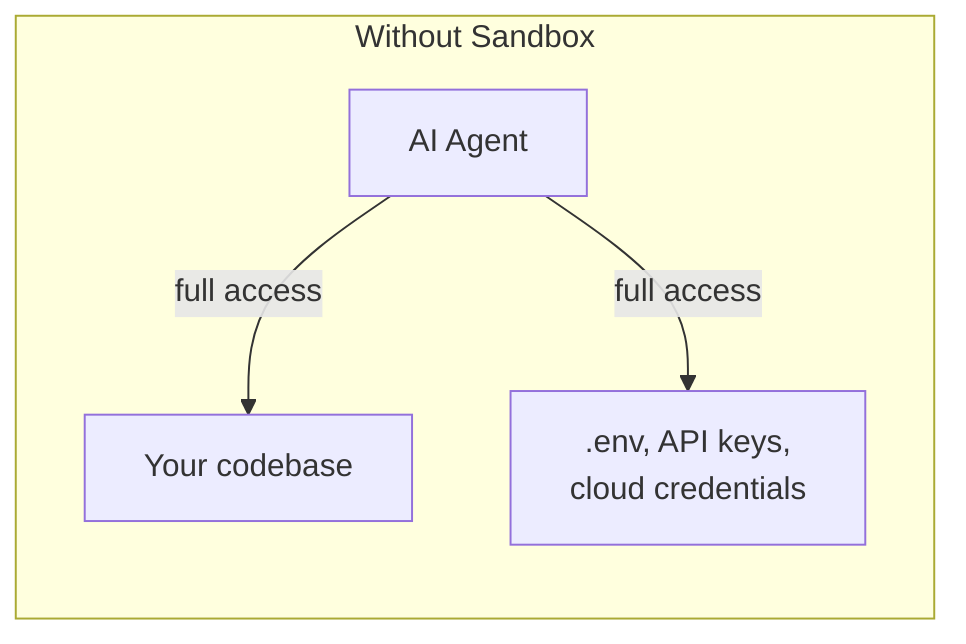
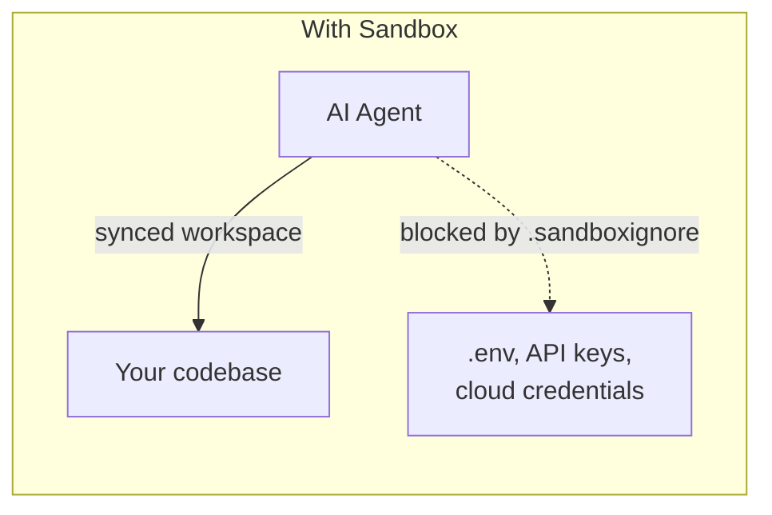
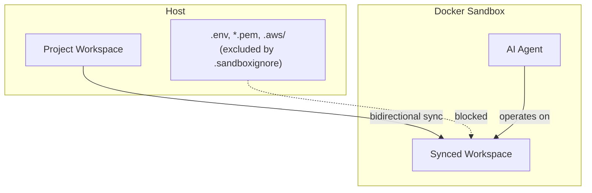

# Security & Sandboxing

Locus can run AI agents inside **Docker Desktop sandboxes** (Docker 4.58+). This page covers the security model: what is protected, what is not, and how to configure it.

---

## Why Sandboxing

AI agents in full-auto mode have unrestricted filesystem access. Without sandboxing, an agent can read `.env` files, API keys, cloud credentials, and any other file on your machine.





---

## Threat Model

**Risks sandboxing addresses:**
- AI agent reads host secrets from local files
- AI agent accesses host-level credentials or system paths
- Sensitive files unintentionally included in model context

**Risks you still need to manage:**
- `--no-sandbox` removes all sandbox protections
- Secrets committed to tracked files are visible in the synced workspace
- Misconfigured `.sandboxignore` rules can re-include sensitive files

---

## Default Secret Protection

When you run `locus init`, Locus generates a `.sandboxignore` with secure defaults:

```text
.env
.env.*
!.env.example
*.pem
*.key
*.p12
*.pfx
*.keystore
credentials.json
service-account*.json
.aws/
.gcp/
.azure/
```

These files are excluded from sandbox execution by default. `!.env.example` is re-included for template use.


These protections depend on `.sandboxignore` rules staying intact. Review changes to this file in PRs as security-sensitive.


---

## `.sandboxignore` Syntax

Uses `.gitignore`-style pattern rules:

| Pattern | Meaning |
|---|---|
| `pattern` | Exclude matching files |
| `dir/` | Exclude matching directories |
| `!pattern` | Re-include (negate previous exclusion) |
| `# comment` | Comment line |

Example:

```text
# Exclude all env files
.env.*

# But keep the template
!.env.example

# Exclude secrets directory
secrets/
```

**Unsafe patterns to avoid:**
- `!.env` -- re-includes production env files
- `!*.pem` -- re-includes private keys
- Removing cloud credential directory exclusions

---

## Sandbox Modes

| Mode | Flag | Behavior |
|------|------|----------|
| Auto (default) | *(no flag)* | Use sandbox if available, warn and fall back if not |
| Required | `--sandbox=require` | Fail if sandbox is unavailable |
| Disabled | `--no-sandbox` | Run unsandboxed (shows safety warning) |

```bash
# Default: auto-sandbox
locus run 42

# Require sandbox (recommended for CI)
locus run 42 --sandbox=require

# Explicitly opt out
locus run 42 --no-sandbox
```

---

## Sync Boundaries



- **Scope:** Active project workspace is synced between host and sandbox
- **Direction:** Bidirectional -- changes from sandboxed execution come back to your workspace
- **Timing:** Sync occurs during command execution; `.sandboxignore` is enforced before agent steps
- **Exclusions:** Files matching `.sandboxignore` patterns are removed from sandbox visibility

---

## Team Security Checklist

- [ ] Docker Desktop 4.58+ is installed and `docker sandbox ls` succeeds
- [ ] CI and automations use `--sandbox=require` to block insecure fallback
- [ ] `.sandboxignore` is version-controlled with `.env`, credential, and cloud config exclusions
- [ ] `.env.example` contains placeholders only (no real secrets)
- [ ] Real secrets are in secret managers, not tracked files
- [ ] Team reviews `.sandboxignore` changes as security-sensitive

---

## Troubleshooting

### "Docker sandbox not available"

Docker Desktop is missing or below 4.58. Upgrade and verify:

```bash
docker sandbox ls
```

### "Docker is not responding"

Start Docker Desktop, wait for initialization, then:

```bash
docker info
```

### File sync delays

Large files or high-frequency writes can cause visible sync latency. Keep large generated artifacts out of active execution loops.

## Related Docs

- [Sandboxing Setup](../getting-started/sandboxing-setup.md)
- [Auto-Approval Mode](auto-approval-mode.md)
- [locus sandbox](../cli/sandbox.md)
