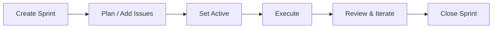
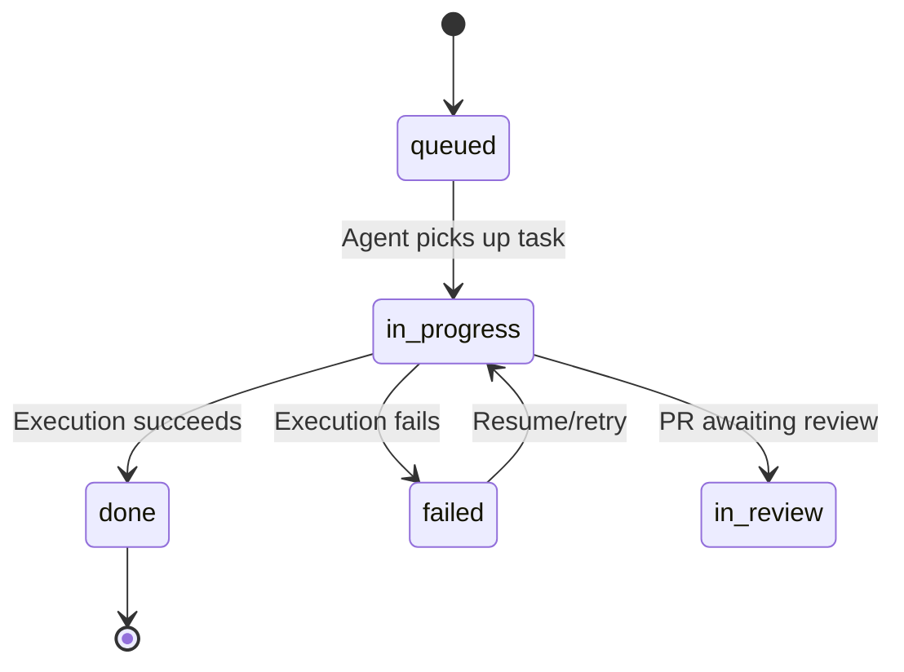

# Sprints and Issues

In Locus, **issues are tasks** and **sprints are milestones**. You create GitHub Issues with structured labels to define work, group them under GitHub Milestones to form sprints, and use order labels to control execution sequence.

---

## Sprint Lifecycle



### 1. Create

```bash
locus sprint create "Sprint 1"
locus sprint create "Sprint 1" --due 2026-03-07 --description "Auth and onboarding"
```

### 2. Plan

Populate the sprint with tasks -- manually or with AI:

```bash
# AI-generated plan
locus plan "Implement user authentication" --sprint "Sprint 1"

# Manual issue creation
locus issue create "Set up OAuth provider" --sprint "Sprint 1"
locus issue create "Add login page UI" --sprint "Sprint 1"
```

### 3. Set Active

```bash
locus sprint active "Sprint 1"
```

Only one sprint can be active at a time. The active sprint is the default target for `locus run`.

### 4. Execute

```bash
locus run
```

### 5. Close

```bash
locus sprint close "Sprint 1"
```

---

## Creating Issues

### Via the CLI

Describe the task in plain language -- AI generates a structured issue:

```bash
locus issue create "Add input validation for email field"
locus issue create "Write API docs" --sprint "Sprint 1"
locus issue create  # Interactive prompt
```

The AI selects a title, writes a body with acceptance criteria, and chooses priority and type. A preview is shown before posting. Issues are automatically labeled with:

- Type label (e.g., `type:feature`)
- Priority label (e.g., `p:high`)
- Status label `locus:queued`
- `agent:managed` label
- Milestone assignment (if `--sprint` is provided)

### Via GitHub

Create issues directly on GitHub and add labels manually:

1. Add a type label (`type:feature`, `type:bug`, `type:chore`, `type:refactor`, `type:docs`)
2. Add a priority label (`p:critical`, `p:high`, `p:medium`, `p:low`)
3. Add `locus:queued` status label
4. Assign to a milestone (sprint)
5. Optionally add `order:N` for execution ordering

---

## Execution Order

Order labels (`order:1`, `order:2`, `order:3`, ...) control the sequence of sprint execution.

### How Order Is Assigned

- **AI planning** -- `locus plan` assigns order labels based on dependency analysis
- **Manual** -- Add `order:N` labels on GitHub
- **CLI reordering** -- `locus sprint order`

### Reordering Tasks

```bash
# View current order
locus sprint order "Sprint 1" --show

# Reorder pending tasks
locus sprint order "Sprint 1" 17 15 16
```

**Rules:**
- Completed tasks (`locus:done`) are frozen and cannot be reordered
- All pending tasks must be included when reordering
- Order numbers start after the highest completed task's order

---

## Issue Status Flow



| Status | Label | Meaning |
|---|---|---|
| Queued | `locus:queued` | Ready for execution |
| In Progress | `locus:in-progress` | AI agent is working |
| Done | `locus:done` | Completed, PR created |
| Failed | `locus:failed` | Execution failed |
| In Review | `locus:in-review` | PR awaiting human review |

Failed tasks can be retried with `locus run --resume`.

---

## AI Sprint Planning

```bash
locus plan "Build a REST API for user management"
```

The AI analyzes your codebase and produces:

- Sprint name and goal
- Ordered list of tasks with descriptions
- Priority and type assignments
- Execution sequence optimized for sequential development

You review and approve (creates sprint + issues), reject with feedback (triggers replanning), or cancel.

```bash
# Assign to specific sprint
locus plan "Build auth system" --sprint "Sprint 1"

# Preview without creating
locus plan "Build auth system" --dry-run

# Organize existing issues into a sprint
locus plan --from-issues --sprint "Sprint 1"
```

---

## Sprint Management Commands

```bash
# List sprints
locus sprint list
locus sprint list --all    # Include closed

# Show sprint details
locus sprint show "Sprint 1"

# Check/set active sprint
locus sprint active
locus sprint active "Sprint 1"
```

## Related Docs

- [How Locus Works](how-it-works.md)
- [Execution Model](execution-model.md)
- [GitHub as Backend](github-backend.md)
- [locus sprint](../cli/sprint.md)
- [locus plan](../cli/plan.md)
