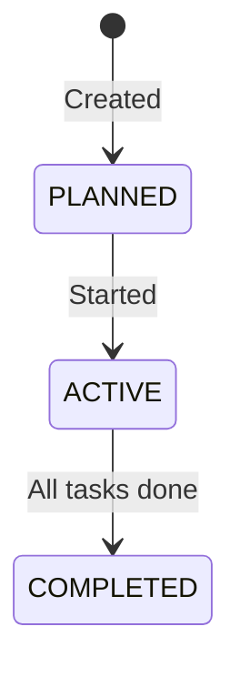
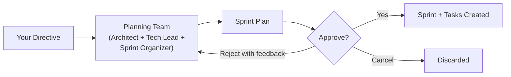

# Sprints

## Overview

A sprint is a time-boxed iteration that groups related tasks together. You can create sprints manually in the dashboard or let AI plan them for you with `locus plan`.

---

## Sprint Lifecycle



| Status      | Meaning |
|------------|---------|
| `PLANNED`  | Sprint is defined but not yet active |
| `ACTIVE`   | Sprint is in progress, tasks can be dispatched |
| `COMPLETED`| All tasks are done |


Only one sprint can be **active** at a time per workspace. You must complete or close the current sprint before starting a new one.


---

## Creating Sprints

### Manually (Dashboard)

1. Open your workspace in the dashboard
2. Go to **Sprints**
3. Click **Create Sprint**
4. Add a name, start/end dates, and select tasks

### AI Sprint Planning

Use the `locus plan` command to have AI create a sprint for you:

```bash
locus plan "implement user authentication with OAuth"
```

This triggers an AI planning meeting where a unified planning team — combining the perspectives of an **Architect**, **Tech Lead**, and **Sprint Organizer** — collaborates in a single pass to produce a complete sprint plan.

#### Planning Meeting Workflow



1. **Directive** — You provide a high-level goal (e.g., "build user authentication with OAuth")
2. **Planning** — The AI planning team analyzes your codebase and produces a structured plan with:
   * Sprint name and goal
   * Sequential tasks with detailed What/Where/How descriptions
   * Assigned roles (`BACKEND`, `FRONTEND`, `QA`, `PM`, `DESIGN`)
   * Priority levels and complexity estimates
   * Risk assessments with mitigations
3. **Review** — You review the plan and choose to approve, reject with feedback (triggers replanning), or cancel

#### Planning Rules

The planning team follows key constraints to ensure tasks execute cleanly:

* Tasks are designed for **sequential execution** by a single agent on one branch
* Each task is **self-contained** — it includes all context an independent agent needs
* No forward dependencies — task N never relies on task N+1
* Foundation work comes first (shared code, types, schemas before features)

#### Managing Plans

```bash
# List pending plans
locus plan --list

# View a plan
locus plan --show <plan-id>

# Approve and create sprint + tasks
locus plan --approve <plan-id>

# Reject with feedback (triggers replanning)
locus plan --reject <plan-id> --feedback "split auth into smaller tasks"

# Cancel
locus plan --cancel <plan-id>
```


When you approve a plan, Locus automatically creates the sprint and all tasks in your workspace.


---

## Running a Sprint

Once a sprint is active with tasks in `BACKLOG`:

```bash
locus run
```

The agent will claim and execute tasks from the active sprint sequentially on a single branch. After each task, changes are committed and pushed. When all tasks are complete, a pull request is created with a summary of the work done.
