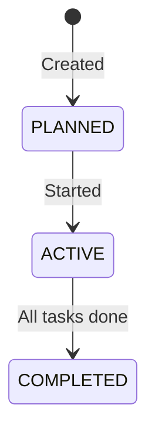
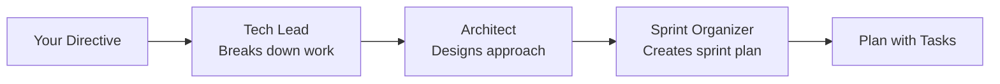

# Sprints

## Overview

A sprint is a time-boxed iteration that groups related tasks together. You can create sprints manually in the dashboard or let AI plan them for you with `locus plan`.

---

## Sprint Lifecycle



| Status      | Meaning |
|------------|---------|
| `PLANNED`  | Sprint is defined but not yet active |
| `ACTIVE`   | Sprint is in progress, tasks can be dispatched |
| `COMPLETED`| All tasks are done |


Only one sprint can be **active** at a time per workspace. You must complete or close the current sprint before starting a new one.


---

## Creating Sprints

### Manually (Dashboard)

1. Open your workspace in the dashboard
2. Go to **Sprints**
3. Click **Create Sprint**
4. Add a name, start/end dates, and select tasks

### AI Sprint Planning

Use the `locus plan` command to have AI create a sprint for you:

```bash
locus plan "implement user authentication with OAuth"
```

This triggers a multi-agent planning meeting:



The output includes:
* Sprint name and description
* Individual tasks with descriptions and priorities
* Risk assessments
* Estimated scope

You can then **approve**, **reject** (with feedback), or **cancel** the plan:

```bash
# List pending plans
locus plan --list

# View a plan
locus plan --show <plan-id>

# Approve and create sprint + tasks
locus plan --approve <plan-id>

# Reject with feedback (triggers replanning)
locus plan --reject <plan-id> --feedback "split auth into smaller tasks"

# Cancel
locus plan --cancel <plan-id>
```


When you approve a plan, Locus automatically creates the sprint and all tasks in your workspace.


---

## Running a Sprint

Once a sprint is active with tasks in `BACKLOG`:

```bash
# Start a single agent
locus run

# Or run multiple agents in parallel
locus run --agents 3
```

Agents will claim and execute tasks from the active sprint until all are complete.
