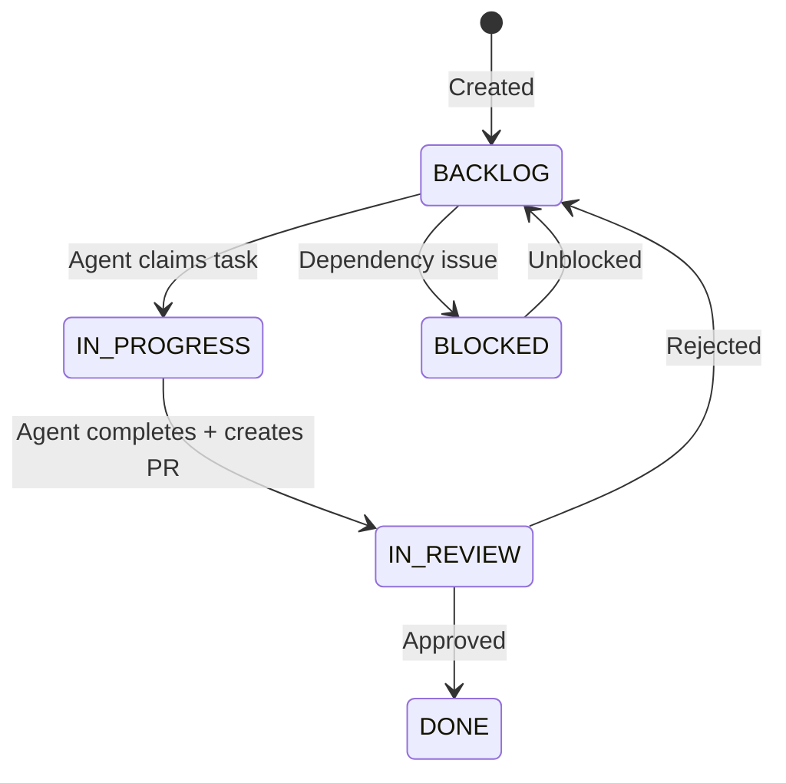

# Tasks

## Overview

A task represents a single piece of work for an AI agent to complete. Tasks are created in the dashboard or via AI sprint planning, then dispatched to agents for execution.

---

## Task Properties

| Property            | Description                                          |
|---------------------|------------------------------------------------------|
| Title               | Short description of the task                        |
| Description         | Detailed requirements and context                    |
| Status              | Current state (see lifecycle below)                  |
| Priority            | LOW, MEDIUM, HIGH, or CRITICAL                       |
| Labels              | Tags for categorization                              |
| Assignee Role       | BACKEND, FRONTEND, QA, PM, or DESIGN                 |
| Sprint              | The sprint this task belongs to                      |
| Due Date            | Optional deadline                                    |
| PR URL              | GitHub pull request link (set by agent)              |
| Acceptance Checklist| Criteria that must be met for completion             |
| Parent Task         | Optional parent for subtask relationships            |

---

## Task Lifecycle

| Status       | Meaning |
|-------------|---------|
| `BACKLOG`   | Ready to be picked up by an agent |
| `IN_PROGRESS` | An agent is actively working on it |
| `IN_REVIEW` | Work is complete, PR created, awaiting review |
| `DONE`      | Approved and merged |
| `BLOCKED`   | Cannot proceed due to a dependency |

---

## Task Dispatch

When you run `locus run`, the CLI requests tasks from the API using a **dispatch** mechanism:

1. The CLI calls the dispatch endpoint
2. The API finds the next available task (status: `BACKLOG`, ordered by priority)
3. The task is **locked** server-side to prevent other agents from claiming it
4. The CLI receives the task details and begins execution


Server-side locking ensures that multiple agents never work on the same task, even when running in parallel.


---

## Acceptance Checklists

Each task can have an acceptance checklist — a list of criteria that define when the task is complete. Agents use this checklist as part of their execution context.

Example:
- [ ] Add input validation for email field
- [ ] Show error message on invalid input
- [ ] Write unit tests for validation logic

Workspaces can define **default acceptance checklists** that are automatically added to new tasks.

---

## Task Rejection

If a completed task doesn't meet your requirements, you can reject it:

* **From the dashboard** — Move the task back to BACKLOG
* **From Telegram** — Use `/rejecttask <id> <feedback>`

When rejected, the task returns to `BACKLOG` with your feedback attached as a comment. The next agent run will pick it up and use your feedback to improve the implementation.
