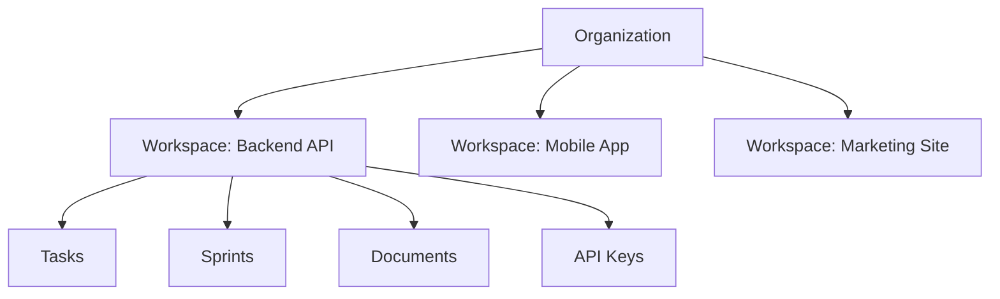

# Workspaces

## Overview

Locus uses a two-level hierarchy:

* **Organizations** — Top-level containers that group workspaces and team members
* **Workspaces** — Project-level containers where tasks, sprints, and documents live



---

## Organizations

An organization represents your team or company. Each organization has members with specific roles:

| Role    | Permissions |
|---------|-------------|
| Owner   | Full control, manage members, delete organization |
| Admin   | Manage workspaces, tasks, sprints, and API keys |
| Member  | Create and work on tasks, view workspaces |
| Viewer  | Read-only access to workspaces and tasks |

---

## Workspaces

A workspace maps to a single project or repository. It contains:

* **Tasks** — Units of work with status, priority, and acceptance criteria
* **Sprints** — Time-boxed iterations grouping tasks
* **Documents** — Knowledge base for the project (PRDs, tech specs, etc.)
* **Activity Feed** — Real-time log of task completions, plan approvals, and agent activity
* **API Keys** — Scoped credentials for CLI access

### Cloud Dashboard

The [Locus Dashboard](https://app.locusai.dev) is the primary interface for managing workspaces. From the dashboard you can create and organize sprints, monitor agent progress, review activity feeds, manage team members, and collaborate with your team across workspaces.

### Creating a Workspace

1. Log in to [app.locusai.dev](https://app.locusai.dev)
2. Select your organization
3. Click **Create Workspace**
4. Name it after your project

---

## Document Syncing

Workspace documents (PRDs, tech specs, architecture notes) are managed in the cloud dashboard and can be synced to your local project for use as AI context during task execution.

```bash
# Sync documents from your workspace to .locus/documents/
locus docs sync
```

Synced documents are stored in `.locus/documents/` and are automatically included as context when agents execute tasks, ensuring they have access to the latest project knowledge.

---

## API Keys

API keys are scoped to a workspace. They authenticate the CLI and Telegram bot.


Your workspace is **automatically resolved** from the API key. You don't need to manually configure a workspace ID.


### Generating a Key

1. Open your workspace in the dashboard
2. Go to **Settings → API Keys**
3. Click **Create API Key**
4. Copy and store the key securely

### Using the Key

```bash
locus config setup --api-key "your-key"
```

Or set it directly:

```bash
locus config set apiKey "your-key"
```


Never commit API keys to your repository. The `.locus/settings.json` file is automatically added to `.gitignore` by `locus init`.

