# Introduction

## What is Locus?

**Locus** is an AI-native project management platform designed for teams that use AI coding agents. It separates _planning_ (in the cloud) from _execution_ (on your machine), so your source code never leaves your infrastructure.


Locus works with **Claude** (Anthropic) and **Codex** (OpenAI) as AI providers. You choose which agent runs your tasks.


### How it works


1. **Plan** — Create sprints and tasks in the [Locus Dashboard](https://app.locusai.dev), or let AI plan them for you with `locus plan`
2. **Dispatch** — Tasks are dispatched to your local machine where the AI agent claims and executes them
3. **Execute** — The agent works on a single branch, executing tasks sequentially and pushing after each one
4. **Review** — A pull request is created when all tasks are done, and you can review with `locus review` or via the Telegram bot

---

## Key Features



AI agents run on **your machine** or **your server**. Source code is never uploaded to any third-party service. Locus only syncs task metadata, status updates, and project context — never your codebase.



An AI agent works through your sprint tasks one by one on a **single branch**. Changes are committed and pushed after each task, and a pull request is created when all tasks are done.



Run `locus plan "build user authentication"` and a unified AI planning team (Architect, Tech Lead, Sprint Organizer) collaborates to create a detailed sprint with tasks, priorities, and risk assessments. Review, approve, reject with feedback, or cancel plans before they become sprints.



Review code with AI using `locus review` for open GitHub PRs or `locus review local` for staged changes. Generates structured reports covering code quality, potential issues, and recommendations.



Start AI-assisted discussions on any topic with full project context. The system extracts structured insights (decisions, requirements, ideas, concerns, learnings) as the conversation progresses, building a knowledge base for your project.



Run `locus index` to build a semantic index of your codebase. Locus maps symbols, file responsibilities, and project structure — then uses incremental updates to re-index only changed files on subsequent runs.



Use `locus exec` to run one-off prompts with full repository context, or `locus exec -i` for an interactive REPL session. Sessions are automatically saved and can be resumed later with `locus exec -s <id>`.



Manage your entire workflow from Telegram. Start agents, approve plans, review tasks, run exec prompts, monitor activity — all from your phone. See the [Telegram guide](telegram/overview.md).



---

## Quick Start

Get up and running in under 2 minutes:

```bash
# Install the CLI
npm install -g @locusai/cli

# Initialize in your project
cd your-project
locus init

# Configure your API key
locus config setup

# Start working on tasks
locus run
```


That's it. Locus will claim the next available task from your active sprint, execute it with your chosen AI provider, and create a pull request when done.


---

## Architecture Overview

```mermaid
graph TB
    subgraph Cloud["☁️ Locus Cloud"]
        Dashboard["Dashboard<br/>(app.locusai.dev)"]
        API["API Server"]
        DB["Database"]
        Dashboard --> API
        API --> DB
    end

    subgraph Local["💻 Your Machine"]
        CLI["Locus CLI"]
        Agent["AI Agent"]
        Branch["Single Branch"]
        CLI --> Agent
        Agent --> Branch
    end

    subgraph Integrations["🔗 Integrations"]
        TG["Telegram Bot"]
        GH["GitHub"]
    end

    API <-->|"Task metadata only"| CLI
    Agent -->|"Push changes"| GH
    TG <-->|"Commands"| CLI
```




Locus syncs **task metadata only** with the cloud — titles, descriptions, statuses, and acceptance criteria. Your source code stays entirely on your machine.


---

## What's Next?

<table data-card-size="large" data-view="cards">

<thead>
<tr>
<th></th>
<th></th>
</tr>
</thead>

<tbody>
<tr>
<td><strong>Installation</strong></td>
<td>Install the Locus CLI and get your environment ready. <a href="getting-started/installation.md">Get started →</a></td>
</tr>
<tr>
<td><strong>Telegram Bot</strong></td>
<td>Control your agents from Telegram. <a href="telegram/overview.md">Learn more →</a></td>
</tr>
<tr>
<td><strong>CLI Reference</strong></td>
<td>Explore all commands and options. <a href="cli/overview.md">View commands →</a></td>
</tr>
<tr>
<td><strong>Self-Hosting</strong></td>
<td>Deploy agents on your own server for 24/7 execution. <a href="self-hosting/overview.md">Setup guide →</a></td>
</tr>
</tbody>

</table>
