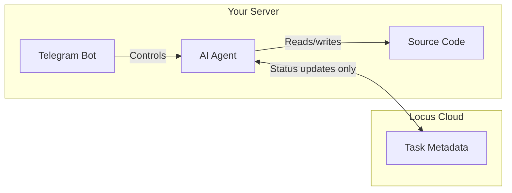

# Why Self-Host?

## The Problem with Running AI Agents Locally

When you run AI coding agents like Claude or Codex on your development machine, they typically operate in **interactive mode** — you see what they're doing, approve file changes, and maintain control.

But on a server, these agents need to run **autonomously**. This means:


**Claude CLI and Codex CLI skip permission prompts and run in dangerous mode by default when running non-interactively.** This means they can read, write, and execute anything on the machine without asking for approval.


This is powerful for automation, but it also means you need to control the environment carefully.

---

## Why Self-Host?

Self-hosting gives you:

### Full Control Over Your Code

Your source code stays on **your infrastructure**. Locus only syncs task metadata (titles, descriptions, statuses) with the cloud — never your codebase.



### 24/7 Agent Availability

With self-hosted agents, you can:

* Dispatch tasks from the dashboard and have them executed automatically
* Control everything from Telegram while away from your desk
* Run agents around the clock without keeping your laptop open

### Isolated Environment

Running on a dedicated server means:

* Agents can't interfere with your local development environment
* You can limit filesystem access and network permissions
* Crashes or runaway processes don't affect your workstation

---

## Security Considerations


Since AI agents run in **dangerous mode** (no permission prompts) on servers, follow these practices:


1. **Dedicated user account** — Run agents under a restricted user, not root
2. **Repository-scoped access** — Only give agents access to the specific repository they need
3. **GitHub token scope** — Use fine-grained tokens with minimum required permissions
4. **Network restrictions** — Consider firewall rules to limit outbound access
5. **Monitor logs** — Review agent output regularly via Telegram or log files
6. **Chat ID restriction** — Always configure the Telegram bot's chat ID to restrict access to your account only

---

## Minimum System Requirements

Since Locus runs AI coding agents (Claude CLI, Codex CLI) alongside background services, the host machine needs sufficient resources.

| Resource | Minimum | Recommended |
|----------|---------|-------------|
| **RAM** | 4 GB | 8 GB |
| **CPU** | 2 cores | 2+ cores |
| **Disk** | 2 GB free | 5 GB+ free |
| **Network** | Stable internet connection | Stable internet connection |
| **Node.js** | 18+ | 22+ |


These requirements are based on the official system requirements for [Claude Code](https://code.claude.com/docs/en/setup) (4 GB+ RAM) and [Codex CLI](https://github.com/openai/codex/blob/main/docs/install.md) (4 GB min, 8 GB recommended). The recommended specs account for running the AI agent, Telegram bot, and system services concurrently.


---

## Getting Started

Locus provides automated setup scripts for:

* **[Linux](linux-setup.md)** — Ubuntu/Debian with systemd services
* **[macOS](macos-setup.md)** — macOS with LaunchAgent services
* **[Windows](windows-setup.md)** — Windows with Scheduled Tasks


**Important:** Claude Code cannot run as root or the built-in Administrator user. You must create a dedicated non-root user (e.g., `ubuntu` or `locus-agent`) and run all installation and Locus commands as that user. See the platform-specific guides for user setup instructions.


### Quick Install

The installer is interactive — just run the command and follow the prompts:

**Linux / macOS:**

```bash
curl -fsSL https://locusai.dev/install.sh | bash
```

**Windows (PowerShell):**

```powershell
irm https://locusai.dev/install.ps1 | iex
```

You'll be guided through entering your repository URL, API key, GitHub token, and optional Telegram configuration. The installer auto-detects your OS (Linux or macOS) and runs the appropriate setup script.


**Use an HTTPS URL for your repository** (e.g. `https://github.com/user/repo.git`). The installer configures `gh auth setup-git` so that git operations (clone, push) are automatically authenticated via your GitHub token.



You can also pass all parameters as flags for non-interactive (scripted) usage:

```bash
curl -fsSL https://locusai.dev/install.sh | bash -s -- \
  --repo "https://github.com/owner/repo.git" \
  --api-key "your-api-key" \
  --gh-token "your-github-token"
```


---

## What Gets Installed

| Component | Description |
|-----------|-------------|
| Node.js 22+ | JavaScript runtime |
| Bun | Fast JavaScript bundler/runtime |
| GitHub CLI (`gh`) | GitHub operations |
| Claude CLI | Anthropic's AI agent |
| Locus CLI | `@locusai/cli` |
| Locus Telegram | `@locusai/telegram` (if configured) |
| Repository clone | Your project code |
| System services | Background processes for agent and bot |
