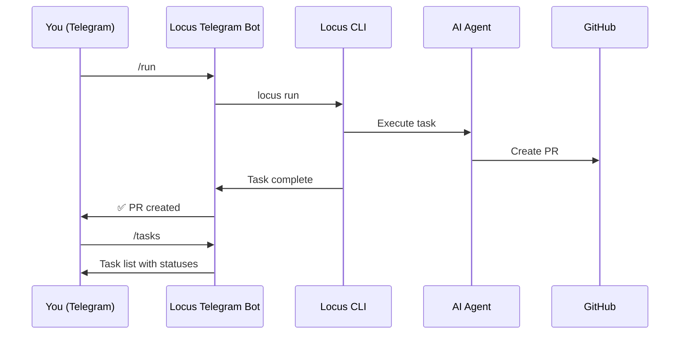

# Telegram Overview

The Locus Telegram bot lets you manage your entire development workflow from your phone or desktop Telegram app. Start agents, plan sprints, approve tasks, run git commands, and monitor progress — all without opening a terminal.

---

## How It Works



The Telegram bot is a **bridge** between your Telegram messages and the Locus CLI. When you send a command like `/run`, the bot executes `locus run` on your machine and streams the output back to you.


The bot runs on **your machine** (or your server), not in the cloud. It has the same access as the CLI — your local filesystem, git, and AI providers.


---

## What You Can Do



Plan sprints, list plans, approve or reject them:

```
/plan implement user authentication
/plans
/approve plan-abc123
/reject plan-abc123 split into smaller tasks
/cancel plan-abc123
```



View active tasks and send rejected tasks back for rework:

```
/tasks
/rejecttask task-123 missing error handling
```



Start agents, run one-off prompts, and stop processes:

```
/run
/exec add validation to the login form
/stop
```



Run whitelisted git commands and development tools:

```
/git status
/git log
/git push
/dev lint
/dev test
/dev build
```



---

## Security

The Telegram bot includes several security measures:

* **Chat ID authentication** — Only messages from your configured chat ID are accepted
* **Command whitelisting** — Git and shell commands are restricted to a safe whitelist
* **No shell injection** — Commands are validated and sanitized before execution
* **Process isolation** — Each command runs as a separate process


Always configure a `chatId` to restrict bot access to your Telegram account. Without it, anyone who finds your bot could execute commands on your machine.


---

## Next Steps

* [Setup Guide](setup.md) — Install and configure the Telegram bot
* [Command Reference](commands.md) — Full list of all bot commands
* [CLI telegram command](../cli/telegram.md) — Configure bot credentials from the CLI
